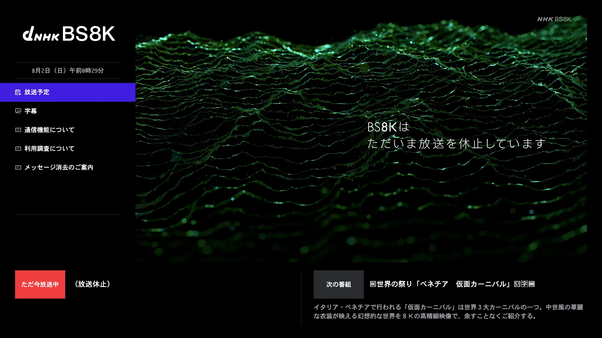
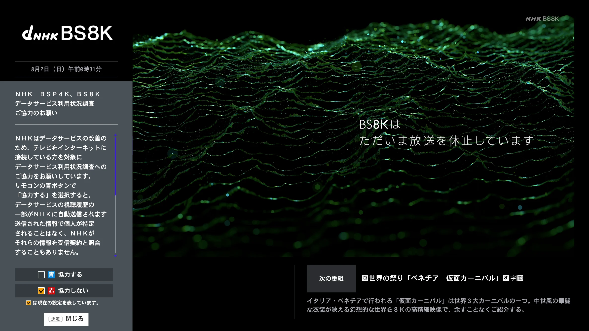
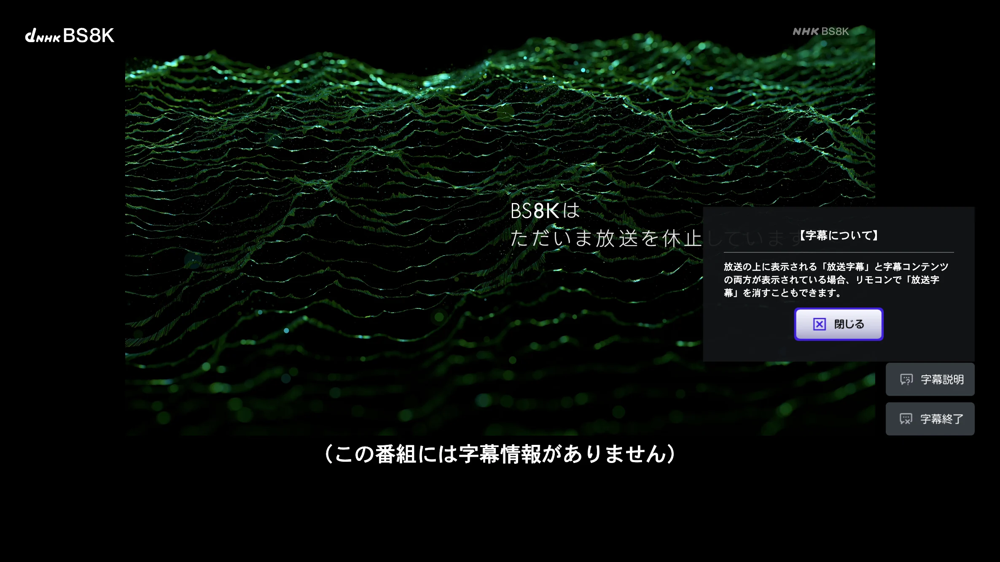
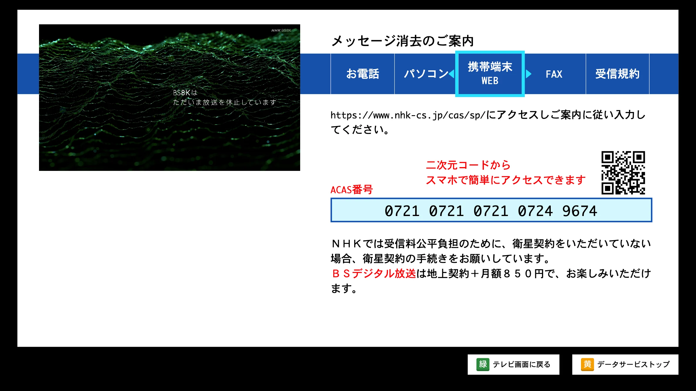

# libaribhtml5

[日本語](#日本語) | [English](#english)

## Demo

<p align="center">
  
</p>
<p align="center">
  
</p>
<p align="center">
  
</p>
<p align="center">
  
</p>

## 日本語

本プロジェクトは、Web ブラウザ上で動作する ARIB HTML5 受信機ランタイムの
プロトタイプです。デモでは、展開済みの BS4K アプリケーションを放送時と同じ
パス構成で配信し、実行前に受信機 API の互換レイヤーを組み込みます。

```sh
pnpm install
pnpm dev
```

起動後、Vite に表示された URL をブラウザで開いてください。放送時と同じ自動起動の
流れを試す場合は**透明起動ページ**、画面を直接開く場合は**表示ページ**を選択します。

### 動作確認済みブラウザ

- Microsoft Edge `150.0.4078.105`（Chromium ベース）
- Firefox `153.0`

Safari には未解決の互換性問題があるため、現時点では対応していません。

### 注意事項

- 放送アプリケーションの一部機能は、放送局のサーバー上にあるデータを参照します。
  このデモでは安全のため、ブラウザから外部サーバーへの通信をすべて遮断しています。
  そのため、オンライン連携を前提とする機能は動作しません。
- 受信機情報として返す ACAS 番号には、デモ用の固定値
  `0721 0721 0721 0724 9674` を使用しています。

### SDK バンドル

npm パッケージとして利用する場合は、以下のようにインストールし、
ESM エントリポイントから読み込みます。

```sh
npm install libaribhtml5
```

```ts
import { AribReceiverHost, installRuntime } from 'libaribhtml5'
```

`<script>` タグから読み込む IIFE 版は `libaribhtml5/iife`、Service Worker は
`libaribhtml5/arib-vfs-sw.js` から利用できます。

```sh
pnpm build:sdk
```

このコマンドを実行すると、`dist/sdk/libaribhtml5.js` とブラウザ VFS 用の
`dist/sdk/arib-vfs-sw.js` が生成されます。`window.ARIBHTML5` からは
`AribReceiverHost`、`ServiceWorkerBroadcastVfs`、`installRuntime` を利用できます。

受信機の内蔵音は `src/runtime/romsound/` 以下で個別の MP3 ファイルとして管理され、
SDK のビルド時にデータ URL として単一の JavaScript バンドルへ埋め込まれます。
iOS/iPadOS では、短い内蔵音の再生によって主映像の Media Session が切り替わるのを
防ぐため、`romsound://` の再生処理は音を出さずに成功を返します。

プレーヤーへ組み込む際のメディアスロット、アダプター、レイヤー構成、
ライフサイクル、字幕連携については、
[メディアプレーン共通統合ガイド](docs/media-plane-integration.md)を参照してください。
[ブラウザ iframe 合成の注意事項](docs/browser-iframe-compositing.md)には、Chromium の
`color-scheme` backdrop と external media hole の実装条件をまとめています。
データ放送を開始する際は `host.loadApplication()`、通常のプレーヤー画面へ戻る際は
`host.exitApplication()` を使用します。
MH-AIT の `AUTOSTART` / `PRESENT` / `KILL`、番組連動アプリケーション、
`replaceApplication()` と EMT の役割分担については、
[MH-AIT アプリケーションライフサイクル](docs/application-lifecycle.md)を参照してください。

録画再生時はシステム時刻ではなく、ストリームの NTP と再生位置を
`host.setBroadcastClock()` に渡します。時刻の変換例は
[録画再生時の放送時計](docs/broadcast-clock.md)を参照してください。

EIT 由来の番組情報や受信機固有情報をホストから受け渡すインターフェースについては、
[受信機ホスト契約](docs/receiver-host-contracts.md)を参照してください。

Service Worker の `/data-broadcast/` ルーティング、データ放送リソースの
保存・更新・解放の流れ、および ARIB 追加記号フォントについては、
[放送リソースとフォント](docs/broadcast-resources-and-fonts.md)を参照してください。

Android/WebView で「放送予定」の検索結果から受信機側の番組表や番組詳細画面を
開く場合は、[`onOpenProgramGuide` とブラウザへのフォールバック](docs/android-program-guide.md)を
参照してください。

## English

libaribhtml5 is a prototype ARIB HTML5 receiver runtime that runs in the browser.
The demo serves an extracted BS4K application using its original broadcast path
layout and installs a compatibility layer for the receiver APIs before the
application starts.

```sh
pnpm install
pnpm dev
```

After starting the development server, open the URL shown by Vite. Choose
**透明起動ページ** to exercise the broadcast autostart flow, or **表示ページ**
to open the visible application page directly.

### Tested browsers

- Microsoft Edge `150.0.4078.105` (Chromium-based)
- Firefox `153.0`

Safari is not currently supported because compatibility issues remain unresolved.

### Notes

- Some broadcast application features fetch data hosted on the broadcaster's
  servers. For safety, this demo blocks all requests to external servers, so
  features that depend on online services will not work.
- The receiver reports the demo ACAS number `0721 0721 0721 0724 9674`.

### SDK bundle

Install the package and import its typed ESM entry point:

```sh
npm install libaribhtml5
```

```ts
import { AribReceiverHost, installRuntime } from 'libaribhtml5'
```

An IIFE build for `<script>` tags is available as `libaribhtml5/iife`. The
Service Worker is available as `libaribhtml5/arib-vfs-sw.js`.

```sh
pnpm build:sdk
```

This command produces `dist/sdk/libaribhtml5.js` and
`dist/sdk/arib-vfs-sw.js` for the browser VFS. The global
`window.ARIBHTML5` object exposes `AribReceiverHost`,
`ServiceWorkerBroadcastVfs`, and `installRuntime`.

Built-in receiver sounds are stored as individual MP3 files under
`src/runtime/romsound/`. The SDK build inlines them as data URLs in the
JavaScript bundle. On iOS and iPadOS, `romsound://` requests succeed without
playing audio, preventing a short receiver sound from taking over the main
video's Media Session.

The [common media-plane integration guide](docs/media-plane-integration.md)
covers media slots, adapters, layering, lifecycle management, and caption
integration. The [browser iframe compositing notes](docs/browser-iframe-compositing.md)
describe the Chromium `color-scheme` backdrop and the requirements for an
external media hole.

Call `host.loadApplication()` when entering data broadcasting and
`host.exitApplication()` when returning to the regular player. See
[MH-AIT application lifecycle](docs/application-lifecycle.md) for `AUTOSTART`,
`PRESENT`, `KILL`, linked applications, `replaceApplication()`, and the EMT
delivery boundary.

For recorded playback, pass stream-derived NTP time and the current playback
position to `host.setBroadcastClock()` instead of using the system clock. See
[broadcast clocks for recorded playback](docs/broadcast-clock.md) for a
conversion example.

See [receiver host contracts](docs/receiver-host-contracts.md) for passing EIT
program metadata and receiver-specific system information from the host. See
[broadcast resources, Worker routing, and fonts](docs/broadcast-resources-and-fonts.md)
for the `/data-broadcast/` namespace, resource lifecycle, and ARIB symbol fonts.

For Android/WebView integrations, see
[`onOpenProgramGuide` and browser fallback](docs/android-program-guide.md) for
opening the receiver's program guide or program details from a search result
for an upcoming program.
